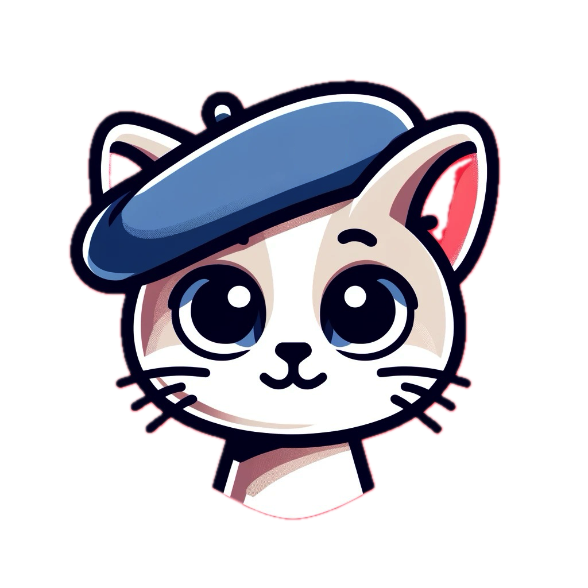
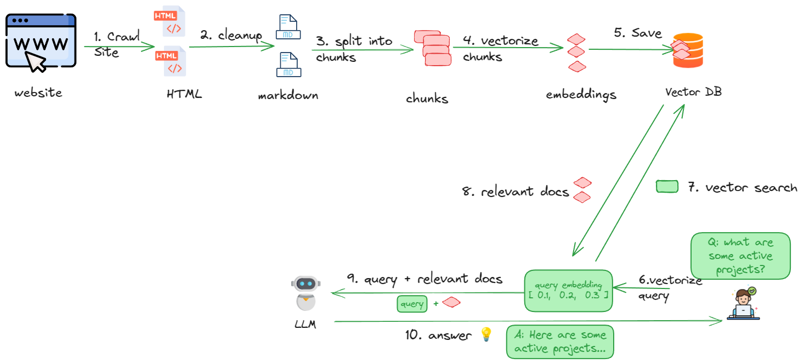

# AllyCat

**AllyCat** is a full stack, open source chatbot that uses GenAI LLMs to answer questions about your website with both traditional Vector RAG and advanced GraphRAG capabilities. It is simple by design and will run on your laptop or server. 

## Why?

AllyCat is purposefully simple so it can be used by developers to learn how RAG-based GenAI works. Yet it is powerful enough to use with your website. You may also extend it for your own purposes. 

⭐ **Found this tool helpful? Give it a star on GitHub to support the project and help others discover it!**

**🗞️ [Allycat news](news.md)** - releases and new features!

## How does it work? 
AllyCat uses your choice of LLM and vector database to implement a chatbot written in Python using [RAG](https://en.wikipedia.org/wiki/Retrieval-augmented_generation) architecture.
AllyCat also includes web scraping tools that extract data from your website (or any website). 

## 🌟🌟 Features 🌟🌟 

1. **Dual RAG Modes:** Traditional Vector RAG and Advanced GraphRAG with entity extraction and community detection
2. **Web Crawling & Scraping:** Text extraction, data/HTML processing, conversion to markdown.
   - **Currently uses:** [Data Prep Kit Connector](https://github.com/data-prep-kit/data-prep-kit/blob/dev/data-connector-lib/doc/overview.md) and [Docling](https://github.com/docling-project/docling)
3. **Processing:** Chunking, vector embedding creation, saving to vector database.
   - **Currently uses:** [Llama Index](https://docs.llamaindex.ai/en/stable/) and [Granite Embedding Model](https://huggingface.co/ibm-granite/granite-embedding-30m-english)
4. **Multiple LLM Support:**
   - **Local:** [Ollama](https://ollama.com/) with [Llama](https://www.llama.com) or [Granite](https://huggingface.co/collections/ibm-granite/granite-33-language-models-67f65d0cca24bcbd1d3a08e3)
   - **Cloud:** OpenAI, Cerebras, Google Gemini, Replicate, Nebius, and more via [LiteLLM](https://docs.litellm.ai/docs)
5. **Multiple Database Support:**
   - **Vector:** [Milvus](https://milvus.io/) (local/embedded) or [Zilliz Cloud](https://zilliz.com/)
   - **Graph:** [Neo4j](https://neo4j.com/) for GraphRAG knowledge graphs
6. **Flexible Deployment:** Docker support with 3 modes (Cloud, Hybrid, Local) + Native Python
7. **Chatbot Interfaces:** Flask web UI and Chainlit chat interface

## ⚡️⚡️Quickstart ⚡️⚡️

There are two ways to run Allycat.

### Option 1: Use the Docker image

A great option for a quick evaluation.  
See [running AllyCat using docker](docs/running-in-docker.md)

### Option 2: Run natively (for tweaking, developing)

Choose this option if you want to tweak AllyCat to fit your needs. For example, experimenting with embedding models or LLMs.  
See [running AllyCat natively](docs/running-natively.md)

## AllyCat Workflow

See [running allycat](docs/running-allycat.md)

## Customizing AllyCat

See [customizing allycat](docs/customizing-allycat.md)

## Deploying AllyCat

See [deployment guide](docs/deploy.md)

## Developing AllyCat

See [developing allycat](docs/developing-allycat.md)

## Why the name **AllyCat**?

Originally AllianceChat, we shortened it to AllyCat when we learned chat means cat in French. Who doesn't love cats?!

